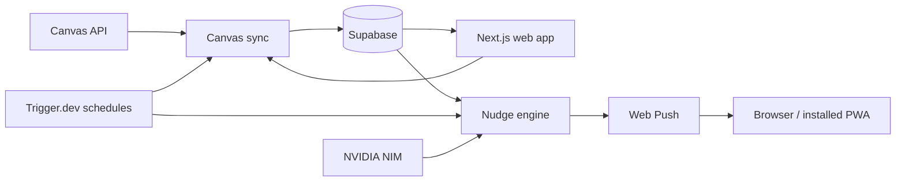

# Architecture

CourseCue has two runtimes: a Next.js web app hosted on Vercel and scheduled tasks hosted on Trigger.dev. Both use Supabase for persistent data.

## Boundaries

| Location | Responsibility |
| --- | --- |
| `src/app/` | App Router routes, layouts, server actions, and API handlers. Folder conventions here determine URLs. |
| `src/components/` | UI grouped by feature. `ui/` contains shared primitives. |
| `src/lib/` | Planner rules, timezone/deadline helpers, Canvas sync, encryption, AI, push lifecycle, validation, and Zustand state. |
| `src/lib/supabase/` | Separate browser and server clients. |
| `src/trigger/` | Canvas sync and reminder schedules, deployed separately. |
| `src/database.types.ts` | Database types consumed by the application. |
| `src/proxy.ts` | Auth session refresh and access handling. |
| `supabase/` | Current schema and historical, manually applied migrations. |
| `worker/index.js` | Custom push and notification-click handlers used by the PWA build. |
| `public/` | Static icons and manifest; generated service workers are ignored by Git. |

Feature folders make components easier to find without changing routes or introducing extra module layers. Keep direct imports through the existing `@/` alias; add a folder when there is a concrete responsibility to group. Framework, TypeScript, Vercel, and Trigger.dev configuration files remain at the root for tool discovery.

## Canvas and planner state

Users supply a Canvas domain and personal token during onboarding. Tokens are encrypted before storage. [`canvas-sync.ts`](../src/lib/canvas-sync.ts) is shared by the web sync endpoint and scheduled task, preserving local completion and dismissal state as Canvas data is refreshed.

The planner supports date windows, search, course filters, and pagination. Completed history uses the locally recorded update timestamp, which may differ from a Canvas submission timestamp. CourseCue does not submit assignments to Canvas.

## Activity insights and reminders

Dashboard activity periodically updates day/hour scores in `productive_windows`. [`ml.ts`](../src/lib/ml.ts) derives patterns with thresholds and score decay. These are activity heuristics, not a trained prediction model or a measure of time spent studying.

Canvas sync runs every 30 minutes; the nudge engine checks every 15 minutes. The engine considers deadlines, recent overdue work, activity windows, timezone, quiet hours, pause state, and frequency preferences. `nudge_logs` holds deduplication claims; `nudge_events` records send history. NVIDIA NIM generates message wording through [`nim.ts`](../src/lib/nim.ts), with fallback text if generation fails.

Overdue reminders are eligible during the first 72 hours after a deadline, at most once per assignment per 24 hours. Older overdue work remains available in the planner.

## Configuration and access

[`env.ts`](../src/lib/env.ts) validates configuration. Public Supabase and VAPID values are available to the browser; service-role, encryption, AI, Redis, and Trigger.dev credentials belong on the server. Supabase tables use row-level security. Scheduled tasks use server credentials to process users' data.

The PWA caches static assets. Authenticated API responses are excluded from runtime caching. [`push.ts`](../src/lib/push.ts) handles subscription lifecycle, including cleanup on sign-out.

## Verification scope

Vitest covers domain rules and integration regressions using mocks, including push lifecycle and worker behaviour. ESLint, TypeScript, and the webpack build check the web app. Live auth, Canvas permissions, migration state, scheduled runs, and device delivery require separate runtime verification.
